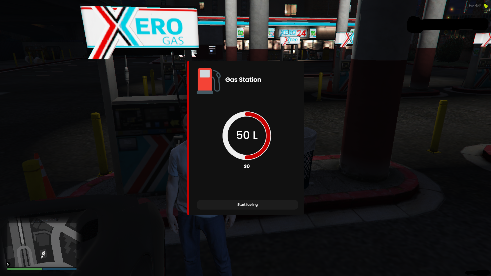

# lucky_tanke

A simple fuel system for FiveM.

### Installation
1) Download the latest version in the "code" tab on GitHub.
2) Drag & drop the folder into your `resources` server folder.
3) Add the `lucky_tanke.sql` to your `database`.
4) Configure the config file to your liking.
5) Add `start lucky_tanke` to your server config.